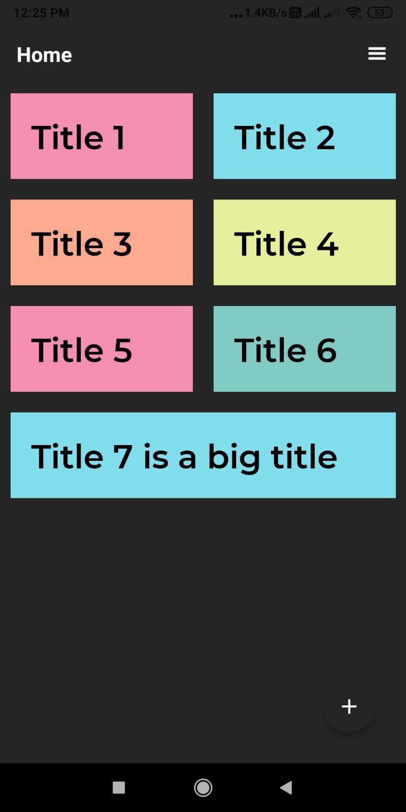
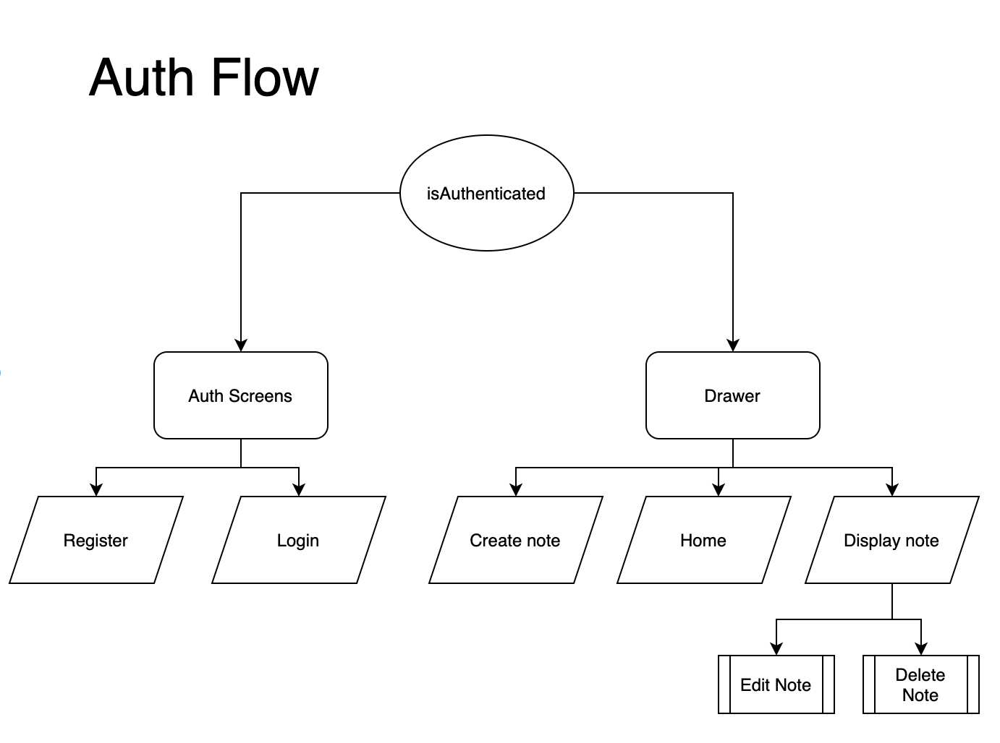
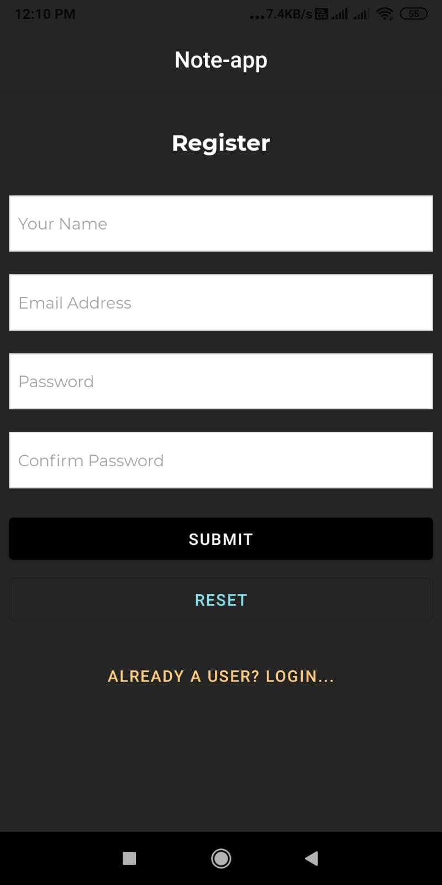
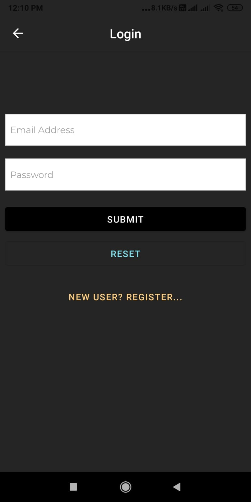
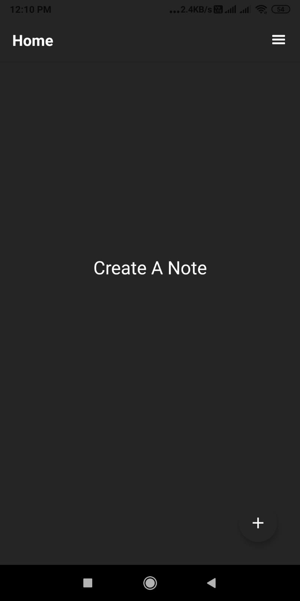
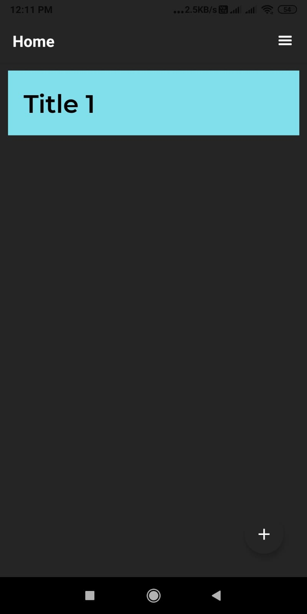
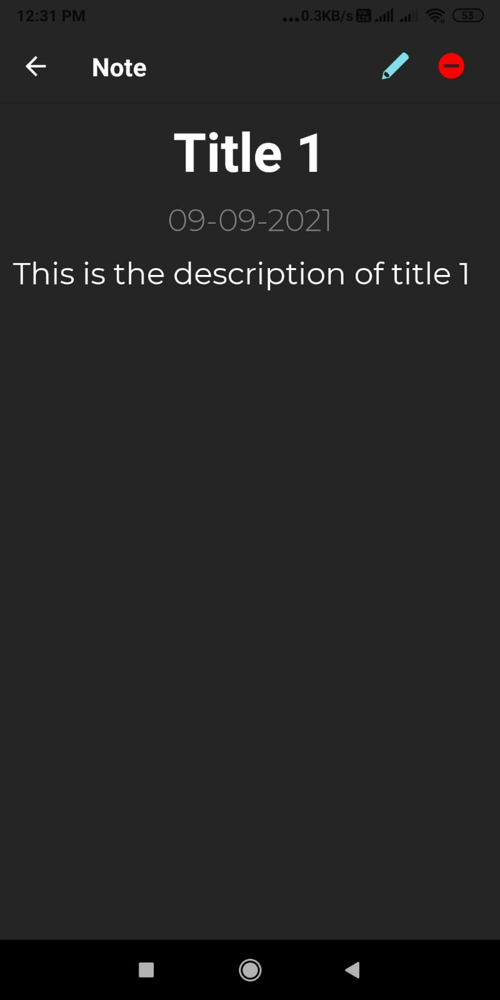
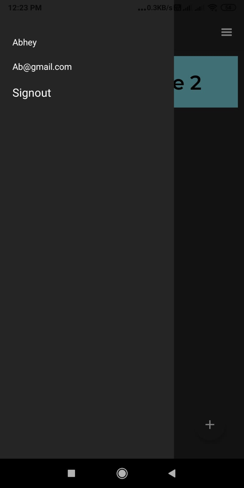

<!-- PROJECT SHIELDS -->

<!-- PROJECT LOGO -->
<br />
<p align="center">
  <a href="https://github.com/abhey-sujith/note-app-react-native">
    
  </a>

  <h3 align="center">Note-app</h3>

</p>


<!-- TABLE OF CONTENTS -->

  <summary><h2 style="display: inline-block">Table of Contents</h2></summary>
  <ol>
    <li>
      <a href="#about-the-project">About The Project</a>
      <ul>
        <li><a href="#built-with">Built With</a></li>
      </ul>
    </li>
    <li>
      <a href="#getting-started">Getting Started</a>
      <ul>
        <li><a href="#prerequisites">Prerequisites</a></li>
        <li><a href="#installation">Installation</a></li>
      </ul>
    </li>
    <li><a href="#usage">Usage</a></li>
    <li><a href="#roadmap">Roadmap</a></li>
    <li><a href="#license">License</a></li>
    <li><a href="#contact">Contact</a></li>
    <li><a href="#acknowledgements">Acknowledgements</a></li>
  </ol>


<!-- ABOUT THE PROJECT -->
## About The Project



A simple note app created with React-native(expo),Redux Toolkit, Redux Persist.


### Built With

* [React-native](https://reactnative.dev/)
* [Redux Toolkit](https://redux-toolkit.js.org/)


<!-- GETTING STARTED -->
## Getting Started

To get a local copy up and running follow these simple steps.

### Prerequisites
  ```sh
   npm install -g expo-cli
   ```
   
### Installation

1. Clone the repo
   ```sh
   git clone https://github.com/abhey-sujith/note-app-react-native
   ```
2. Install NPM packages
   ```sh
   npm install
   ```
 
 ### App
App Link :- [https://drive.google.com/file/d/1fEmBKX2JR6Clk6rNnNF7NZECyuQUJaBx/view?usp=sharing](https://drive.google.com/file/d/1fEmBKX2JR6Clk6rNnNF7NZECyuQUJaBx/view?usp=sharing)

### Backend APIs
laravel :- https://github.com/abhey-sujith/note-app-laravel-api
[https://github.com/abhey-sujith/note-app-laravel-api](https://github.com/abhey-sujith/note-app-laravel-api)


<!-- USAGE EXAMPLES -->
## Usage

## Auth Flow Diagram


## Register Screen


## Login Screen


## Home Empty Screen


## Home Screen


## Show Note Screen


## Drawer



<!-- ROADMAP -->
## Roadmap

✅ Setup Project

✅ Setup Navigator

✅ Setup Redux

✅ Setup Redux-persist

✅ Create Screens

✅ Register

✅ Login

✅ Home

✅ Drawer

✅ Display note

✅ Edit note

✅ Delete note

✅ Create and add icon and splash screen

✅ Make the apk

✅ Test the apk

Improvements
☑️ Add toggle to switch to light mode
☑️ add immage save functionality

<!-- LICENSE -->
## License

Distributed under the MIT License. See `LICENSE` for more information.


<!-- CONTACT -->
## Contact

Abhey Sujith  - abheysujith@gmail.com

Project Link: [https://github.com/abhey-sujith/note-app-react-native](https://github.com/abhey-sujith/note-app-react-native)


<!-- ACKNOWLEDGEMENTS -->
## Acknowledgements

* [Inspiration for UI](https://dribbble.com/shots/11875872-A-simple-and-lightweight-note-app)

